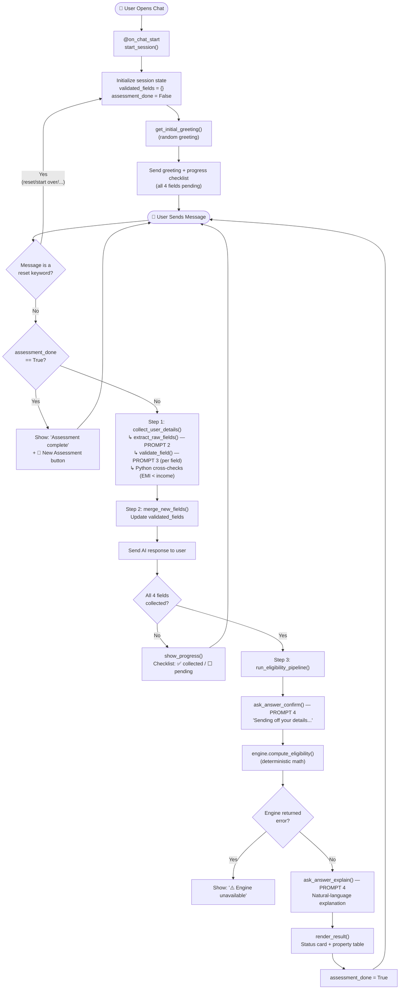
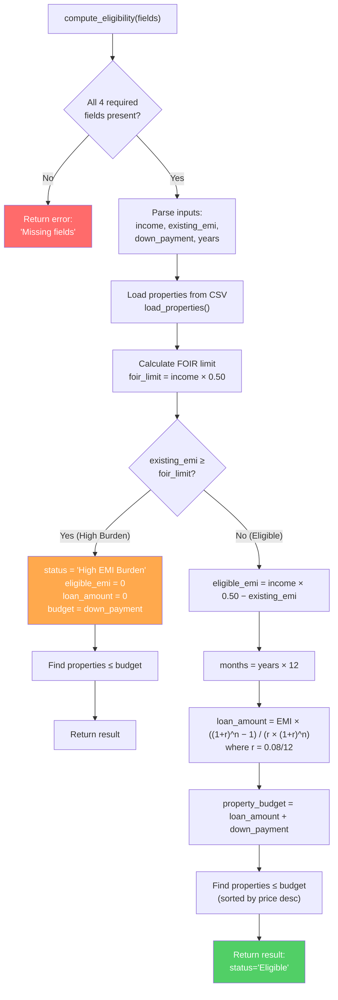
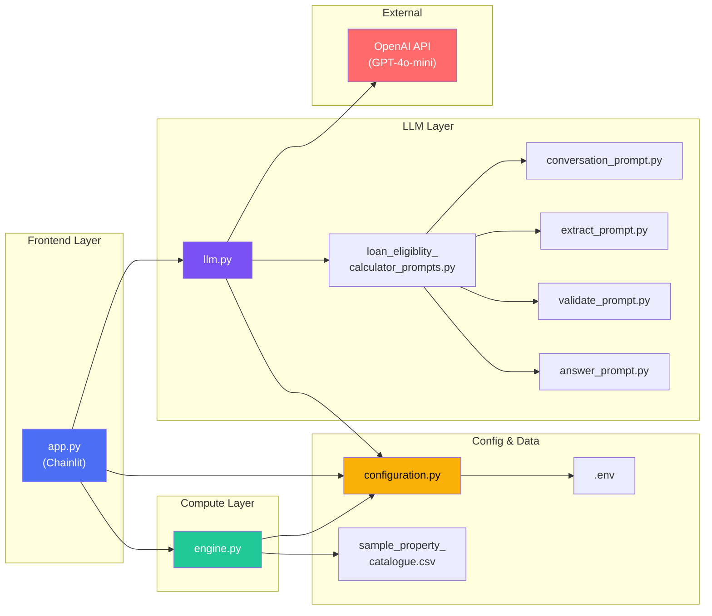
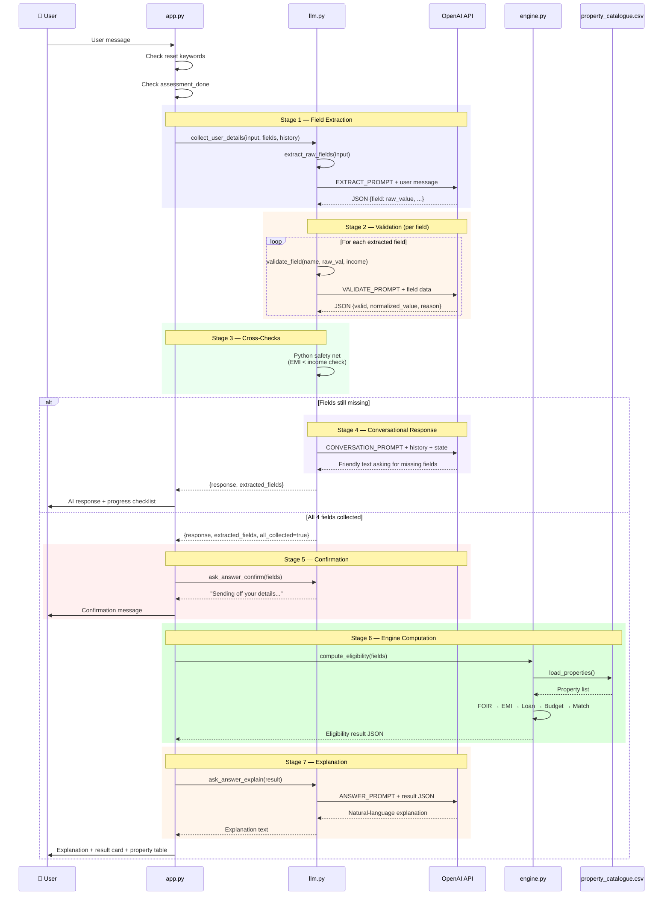
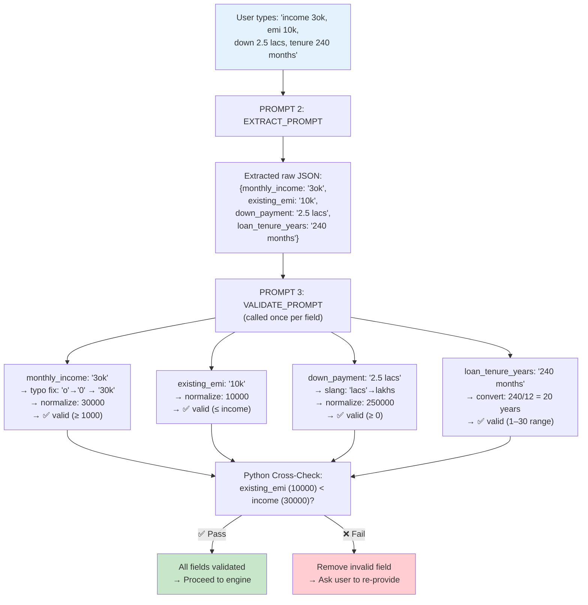
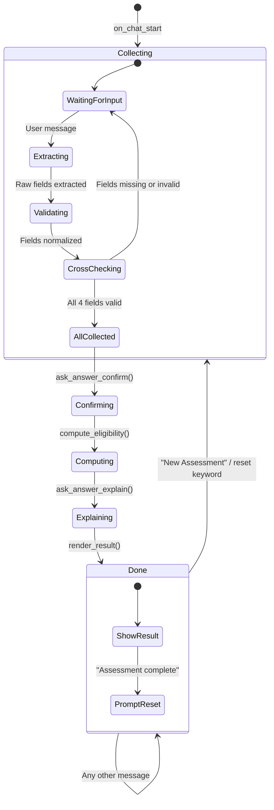

# 🏦 Loan Eligibility & EMI Advisor — Project Understanding

> A conversational AI chatbot built with **Chainlit** + **OpenAI GPT-4o-mini** that collects user financial details through natural dialogue, validates & normalizes inputs via a multi-stage LLM prompt pipeline, computes home-loan eligibility using a deterministic engine, and recommends matching properties from a CSV catalogue.

---

## 📁 Project Structure

```
LOAN_ELIGIBLITY_CALCULATOR/
│
├── app.py                              # Chainlit frontend — orchestrates the full pipeline
├── engine.py                           # Deterministic loan eligibility calculator
├── llm.py                              # LLM layer — extraction, validation, conversation, explanation
├── configuration.py                    # Centralized config — API keys, model, field definitions
├── loan_eligiblity_calculator_prompts.py   # Prompt aggregator — re-exports all 4 prompts
│
├── conversation_prompt.py              # Prompt 1: Conversational field collection
├── extract_prompt.py                   # Prompt 2: Raw field extraction from user text
├── validate_prompt.py                  # Prompt 3: Field validation & normalization
├── answer_prompt.py                    # Prompt 4: Result confirmation & explanation
│
├── sample_property_catalogue.csv       # 50 properties (id, name, location, price)
├── requirements.txt                    # chainlit, openai, python-dotenv
├── .env                                # OPENAI_API_KEY, OPENAI_MODEL
│
├── public/                             # Static assets served by Chainlit
│   ├── advisor_avatar.png
│   ├── favicon.png
│   └── logo_light.png
│
├── storage/                            # Runtime storage (currently empty)
└── .chainlit/
    └── config.toml                     # Chainlit UI configuration
```

---

## 🔄 Input / Output Structure

### Required User Inputs (4 Fields)

| # | Field Name           | Label                          | Accepted Formats                                     | Normalization Target       |
|---|----------------------|--------------------------------|------------------------------------------------------|----------------------------|
| 1 | `monthly_income`     | Monthly Income                 | `50000`, `50k`, `50 K`, `Rs.50,000`, `1 lakh`       | Plain number (₹)           |
| 2 | `existing_emi`       | Existing Monthly EMI           | `10000`, `10k`, `0`, `no`, `nil`                     | Plain number (₹), ≥ 0      |
| 3 | `down_payment`       | Down Payment                   | `250000`, `2.5 lakh`, `2.5 lakhs`                    | Plain number (₹), ≥ 0      |
| 4 | `loan_tenure_years`  | Loan Tenure (years or months)  | `5 years`, `60 months`, `240 months`, `20`           | Years (integer), 1–30      |

### System Output (Eligibility Result)

```json
{
  "status": "Eligible | High EMI Burden",
  "reason": "...",                        // only if High EMI Burden
  "eligible_emi": 15000.00,               // ₹ per month
  "loan_amount": 1234567.89,              // ₹ total loan principal
  "property_budget": 1484567.89,          // loan_amount + down_payment
  "matching_properties": [                // sorted by price descending
    {
      "id": "P001",
      "name": "Green Valley Apartments",
      "location": "Mumbai",
      "price": 4500000
    }
  ]
}
```

---

## 🧠 Multi-Stage LLM Prompt Pipeline

The system uses **4 specialized prompts**, each sent as a separate LLM call with a focused role:

```
┌──────────────────────────────────────────────────────────────────────────┐
│                    LLM PROMPT PIPELINE (4 Stages)                       │
├──────────────────────────────────────────────────────────────────────────┤
│                                                                          │
│  PROMPT 1 ─ CONVERSATION_PROMPT (conversation_prompt.py)                │
│  ├─ Role: "Loan Eligibility Advisor, a professional financial banker"   │
│  ├─ Goal: Natural conversation to ask for missing fields                │
│  ├─ Input: conversation_history, collected fields, missing fields       │
│  └─ Output: Plain-text friendly response (NO JSON)                     │
│                                                                          │
│  PROMPT 2 ─ EXTRACT_PROMPT (extract_prompt.py)                          │
│  ├─ Role: "Information Extraction stage"                                │
│  ├─ Goal: Extract raw unstructured values from user message             │
│  ├─ Input: Single user message                                          │
│  └─ Output: JSON with raw field values (only mentioned fields)          │
│                                                                          │
│  PROMPT 3 ─ VALIDATE_PROMPT (validate_prompt.py)                        │
│  ├─ Role: "Validation & Normalization stage"                            │
│  ├─ Goal: Normalize raw values → clean numbers, or reject with reason   │
│  ├─ Input: One field name + raw value (+ optional known income)         │
│  └─ Output: JSON {field, valid, normalized_value, reason}               │
│                                                                          │
│  PROMPT 4 ─ ANSWER_PROMPT (answer_prompt.py)                            │
│  ├─ Role: "Answer / Explanation stage"                                  │
│  ├─ Modes: "confirm" (pre-engine) or "explain_result" (post-engine)    │
│  ├─ Input: Validated fields JSON or engine result JSON                  │
│  └─ Output: Plain-text natural-language explanation (NO JSON)           │
│                                                                          │
└──────────────────────────────────────────────────────────────────────────┘
```

---

## 📊 Complete Application Flowchart



---

## ⚙️ Engine Computation Flowchart



---

## 🔗 Module Dependency Diagram



---

## 🧩 LLM Call Sequence (Per User Message)



---

## 📐 EMI & Loan Calculation Formula

```
┌───────────────────────────────────────────────────────────────────┐
│                    FINANCIAL FORMULAS                             │
├───────────────────────────────────────────────────────────────────┤
│                                                                   │
│  Constants:                                                       │
│    FOIR (Fixed Obligation to Income Ratio) = 0.50 (50%)          │
│    Annual Interest Rate = 8% (0.08)                               │
│    Monthly Interest Rate (r) = 0.08 / 12 = 0.006667              │
│                                                                   │
│  Step 1: FOIR Limit                                              │
│  ┌─────────────────────────────────────────────┐                 │
│  │ foir_limit = monthly_income × 0.50          │                 │
│  └─────────────────────────────────────────────┘                 │
│                                                                   │
│  Step 2: Eligible EMI                                            │
│  ┌─────────────────────────────────────────────┐                 │
│  │ eligible_emi = foir_limit − existing_emi    │                 │
│  │             = (income × 0.50) − existing_emi│                 │
│  └─────────────────────────────────────────────┘                 │
│                                                                   │
│  Step 3: Loan Amount (Present Value of Annuity)                  │
│  ┌─────────────────────────────────────────────┐                 │
│  │                    (1 + r)^n − 1             │                 │
│  │ loan_amount = EMI × ───────────────          │                 │
│  │                     r × (1 + r)^n            │                 │
│  │                                               │                 │
│  │ where: r = 0.08/12, n = tenure_years × 12   │                 │
│  └─────────────────────────────────────────────┘                 │
│                                                                   │
│  Step 4: Property Budget                                         │
│  ┌─────────────────────────────────────────────┐                 │
│  │ property_budget = loan_amount + down_payment │                 │
│  └─────────────────────────────────────────────┘                 │
│                                                                   │
│  Step 5: Property Matching                                       │
│  ┌─────────────────────────────────────────────┐                 │
│  │ matching = [p for p in catalogue             │                 │
│  │            if p.price ≤ property_budget]     │                 │
│  │ sorted by price (descending)                 │                 │
│  └─────────────────────────────────────────────┘                 │
│                                                                   │
└───────────────────────────────────────────────────────────────────┘
```

### Worked Example

```
┌─────────────────────────────────────────────────────────────────┐
│  INPUT                                                           │
│    monthly_income    = ₹1,00,000                                │
│    existing_emi      = ₹10,000                                  │
│    down_payment      = ₹5,00,000                                │
│    loan_tenure_years = 20                                        │
├─────────────────────────────────────────────────────────────────┤
│  CALCULATION                                                     │
│    foir_limit    = 1,00,000 × 0.50          = ₹50,000           │
│    eligible_emi  = 50,000 − 10,000          = ₹40,000           │
│    r = 0.08/12 = 0.006667                                       │
│    n = 20 × 12  = 240 months                                    │
│    factor = (1.006667)^240 = 4.9268                              │
│    loan_amount = 40,000 × (4.9268−1)/(0.006667×4.9268)          │
│               = 40,000 × 3.9268 / 0.03285                       │
│               ≈ ₹47,82,147                                       │
│    budget = 47,82,147 + 5,00,000            ≈ ₹52,82,147        │
├─────────────────────────────────────────────────────────────────┤
│  OUTPUT                                                          │
│    status          = "Eligible"                                  │
│    eligible_emi    = ₹40,000/month                               │
│    loan_amount     ≈ ₹47,82,147                                  │
│    property_budget ≈ ₹52,82,147                                  │
│    matching props  = All properties with price ≤ ₹52,82,147     │
└─────────────────────────────────────────────────────────────────┘
```

---

## 🛡️ Validation & Normalization Pipeline



---

## 🏗️ Session State Machine



---

## 📦 Data Structures

### Session Variables (Chainlit `cl.user_session`)

```
┌─────────────────────────┬──────────────────────────────────────────────────┐
│ Key                      │ Type & Description                              │
├─────────────────────────┼──────────────────────────────────────────────────┤
│ validated_fields         │ dict — Collected & validated user inputs        │
│                          │   e.g. {"monthly_income": 50000, ...}          │
├─────────────────────────┼──────────────────────────────────────────────────┤
│ assessment_done          │ bool — True after eligibility result rendered   │
├─────────────────────────┼──────────────────────────────────────────────────┤
│ conversation_history     │ list[dict] — Chat history for LLM context      │
│                          │   [{"role": "user"|"assistant", "content": ..}] │
└─────────────────────────┴──────────────────────────────────────────────────┘
```

### LLM Response Structure (`process_conversation` return)

```
┌─────────────────────────┬──────────────────────────────────────────────────┐
│ Key                      │ Type & Description                              │
├─────────────────────────┼──────────────────────────────────────────────────┤
│ response                 │ str — Text to display to user                   │
├─────────────────────────┼──────────────────────────────────────────────────┤
│ extracted_fields         │ dict — Newly validated fields from this turn    │
├─────────────────────────┼──────────────────────────────────────────────────┤
│ all_fields_collected     │ bool — True if all 4 fields now available       │
└─────────────────────────┴──────────────────────────────────────────────────┘
```

### Validation Result Structure (`validate_field` return)

```json
{
  "field": "monthly_income",
  "valid": true,
  "normalized_value": 50000,
  "reason": null
}
```

```json
{
  "field": "loan_tenure_years",
  "valid": false,
  "normalized_value": null,
  "reason": "The tenure value '-5' is negative. Could you please provide a valid loan tenure between 1 and 30 years? For example: '10 years' or '120 months'."
}
```

---

## 🗂️ Property Catalogue Structure

```
sample_property_catalogue.csv (50 properties)
┌──────────────┬─────────────────────────────┬───────────────────┬────────────┐
│ property_id  │ property_name               │ location          │ price (₹)  │
├──────────────┼─────────────────────────────┼───────────────────┼────────────┤
│ P001         │ Green Valley Apartments     │ Mumbai            │ 45,00,000  │
│ P002         │ Sunrise Heights             │ Pune              │ 32,00,000  │
│ P003         │ Lakeview Residency          │ Bangalore         │ 58,00,000  │
│ ...          │ ...                         │ ...               │ ...        │
│ P036         │ Golden Palm Villas          │ Goa               │ 95,00,000  │
│ P050         │ West End Heights            │ Navi Mumbai       │ 57,00,000  │
├──────────────┴─────────────────────────────┴───────────────────┴────────────┤
│ Price Range: ₹19,00,000 (P012) — ₹95,00,000 (P036)                        │
│ Locations: 38 unique cities across India                                    │
└─────────────────────────────────────────────────────────────────────────────┘
```

---

## 🔌 Configuration & Environment

```
┌───────────────────────────────────────────────────────┐
│  .env                                                  │
│  ├─ OPENAI_API_KEY = <your-key>                       │
│  └─ OPENAI_MODEL   = gpt-4o-mini                     │
│                                                        │
│  configuration.py                                      │
│  ├─ MODEL_NAME     = gpt-4o-mini (from env)           │
│  ├─ MAX_TOKENS     = 1024                              │
│  ├─ TEMPERATURE    = 0.2                               │
│  ├─ FOIR (engine)  = 0.50 (50%)                       │
│  ├─ Interest Rate  = 8% per annum                      │
│  └─ REQUIRED_FIELDS = [monthly_income,                │
│                         existing_emi,                  │
│                         down_payment,                  │
│                         loan_tenure_years]             │
└───────────────────────────────────────────────────────┘
```

---

## 🚀 How to Run

```bash
# 1. Install dependencies
pip install -r requirements.txt

# 2. Set your OpenAI API key in .env
#    OPENAI_API_KEY=sk-...

# 3. Run the Chainlit app
chainlit run app.py
```

---

## 📋 Reset Keywords

The user can restart the assessment at any time by typing any of these:

| Keyword            | Action                       |
|--------------------|------------------------------|
| `new assessment`   | Clears session, starts over  |
| `start over`       | Clears session, starts over  |
| `reset`            | Clears session, starts over  |
| `recalculate`      | Clears session, starts over  |
| `new check`        | Clears session, starts over  |
| `start again`      | Clears session, starts over  |
| `restart`          | Clears session, starts over  |

Additionally, a **🔄 New Assessment** action button appears after the result is rendered.

---

## 🔒 Safety & Edge Cases

```
┌─────────────────────────────────────────────────────────────────┐
│  VALIDATION GUARDS                                               │
├─────────────────────────────────────────────────────────────────┤
│                                                                   │
│  LLM-Level (VALIDATE_PROMPT):                                    │
│  ├─ Negative numbers → rejected                                 │
│  ├─ monthly_income < ₹1,000 → rejected                         │
│  ├─ existing_emi > monthly_income → rejected                    │
│  ├─ Non-numeric input → rejected                                │
│  ├─ Tenure outside 1–30 years → rejected                        │
│  └─ Typo correction: 'o'/'O' → '0' (e.g., "3ok" → "30k")     │
│                                                                   │
│  Python-Level (llm.py cross-checks):                             │
│  ├─ If EMI > income after merge → remove conflicting field      │
│  └─ Ask user to re-provide the problematic value                 │
│                                                                   │
│  Engine-Level (engine.py):                                       │
│  ├─ Missing fields → return error dict                           │
│  └─ EMI ≥ FOIR limit → "High EMI Burden" (not rejected)        │
│                                                                   │
└─────────────────────────────────────────────────────────────────┘
```

---

## 🎨 UI Components (Chainlit)

```mermaid
graph TD
    subgraph "Chat Interface"
        GREET["🏦 Greeting Message<br/>(with advisor avatar)"]
        PROGRESS["📊 Progress Checklist<br/>✅ Collected / ⬜ Pending"]
        CONVO["💬 Conversational Responses<br/>(asking for missing fields)"]
        CONFIRM["📋 Confirmation Message<br/>(summarizing collected data)"]
        EXPLAIN["📝 Explanation<br/>(natural-language result)"]
        CARD["📊 Result Card<br/>(status + EMI + loan + budget table)"]
        PROPS["🏠 Property Table<br/>(matching properties)"]
        ACTION["🔄 New Assessment Button"]
    end

    GREET --> PROGRESS
    PROGRESS --> CONVO
    CONVO --> PROGRESS
    CONVO --> CONFIRM
    CONFIRM --> EXPLAIN
    EXPLAIN --> CARD
    CARD --> PROPS
    PROPS --> ACTION

    style GREET fill:#4c6ef5,color:#fff
    style CARD fill:#20c997,color:#fff
    style ACTION fill:#fab005,color:#000
```



---

## 📊 End-to-End Data Flow (ASCII)

```
 USER                    APP.PY                 LLM.PY                 OPENAI API              ENGINE.PY           CSV
  │                        │                      │                      │                       │                  │
  │  "income 50k, emi 0"  │                      │                      │                       │                  │
  │───────────────────────>│                      │                      │                       │                  │
  │                        │  extract_raw_fields()│                      │                       │                  │
  │                        │─────────────────────>│  EXTRACT_PROMPT      │                       │                  │
  │                        │                      │─────────────────────>│                       │                  │
  │                        │                      │<─────────────────────│                       │                  │
  │                        │                      │  {"monthly_income":  │                       │                  │
  │                        │                      │   "50k",             │                       │                  │
  │                        │                      │   "existing_emi":"0"}│                       │                  │
  │                        │                      │                      │                       │                  │
  │                        │  validate_field() ×2 │                      │                       │                  │
  │                        │─────────────────────>│  VALIDATE_PROMPT ×2  │                       │                  │
  │                        │                      │─────────────────────>│                       │                  │
  │                        │                      │<─────────────────────│                       │                  │
  │                        │                      │  {valid:true,        │                       │                  │
  │                        │                      │   norm:50000}        │                       │                  │
  │                        │                      │  {valid:true,        │                       │                  │
  │                        │                      │   norm:0}            │                       │                  │
  │                        │                      │                      │                       │                  │
  │                        │  (2 of 4 fields)     │                      │                       │                  │
  │                        │─────────────────────>│  CONVERSATION_PROMPT │                       │                  │
  │                        │                      │─────────────────────>│                       │                  │
  │                        │                      │<─────────────────────│                       │                  │
  │                        │                      │  "Great! Now I need  │                       │                  │
  │                        │                      │   your down payment  │                       │                  │
  │                        │                      │   and loan tenure."  │                       │                  │
  │  response + checklist  │                      │                      │                       │                  │
  │<───────────────────────│                      │                      │                       │                  │
  │                        │                      │                      │                       │                  │
  │  "dp 5 lakh 20 years"  │                      │                      │                       │                  │
  │───────────────────────>│                      │                      │                       │                  │
  │                        │  [extract + validate] │                     │                       │                  │
  │                        │─────────────────────>│─────────────────────>│                       │                  │
  │                        │                      │<─────────────────────│                       │                  │
  │                        │                      │                      │                       │                  │
  │                        │  ALL 4 FIELDS ✅      │                      │                       │                  │
  │                        │                      │                      │                       │                  │
  │  confirmation msg      │  ask_answer_confirm()│                      │                       │                  │
  │<───────────────────────│                      │                      │                       │                  │
  │                        │                      │                      │  compute_eligibility() │                  │
  │                        │──────────────────────│──────────────────────│──────────────────────>│  load_properties()│
  │                        │                      │                      │                       │─────────────────>│
  │                        │                      │                      │                       │<─────────────────│
  │                        │                      │                      │                       │  FOIR→EMI→Loan   │
  │                        │                      │                      │                       │  →Budget→Match   │
  │                        │<─────────────────────│──────────────────────│───────────────────────│                  │
  │                        │                      │                      │                       │                  │
  │                        │  ask_answer_explain() │                     │                       │                  │
  │                        │─────────────────────>│  ANSWER_PROMPT       │                       │                  │
  │                        │                      │─────────────────────>│                       │                  │
  │                        │                      │<─────────────────────│                       │                  │
  │                        │                      │                      │                       │                  │
  │  explanation +         │                      │                      │                       │                  │
  │  result card +         │                      │                      │                       │                  │
  │  property table +      │                      │                      │                       │                  │
  │  🔄 New Assessment     │                      │                      │                       │                  │
  │<───────────────────────│                      │                      │                       │                  │
  │                        │                      │                      │                       │                  │
```

---

> **Generated for**: Loan Eligibility & EMI Advisor project  
> **Last updated**: July 2026
